# Transactional SMS Analyzer

## Technology stack or tools

- Kotlin

- https://github.com/AnyChart/AnyChart

- https://stackoverflow.com/questions/31068134/extract-parse-amount-and-description-from-biz-transaction-sms

- Android Studio 4.0

- Runtime version: 1.8.0_242-release-1644-b01 amd64

- VM: OpenJDK 64-Bit Server VM by JetBrains s.r.o

- Windows 10

## Screenshots

- Allow permission in order to read sms.

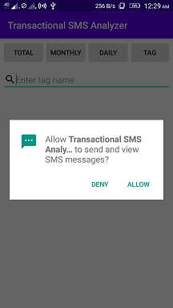
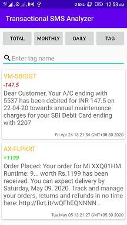

- To add or modify tag name, click on the sms
- Tag will be added in top-right corner of the sms

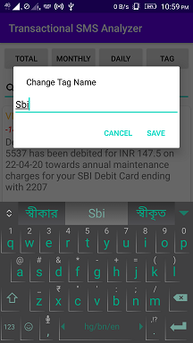
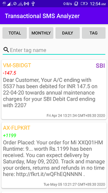
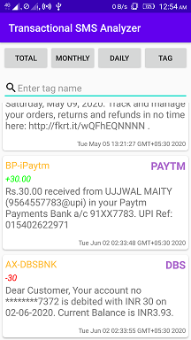

- Type tag name to sort out sms

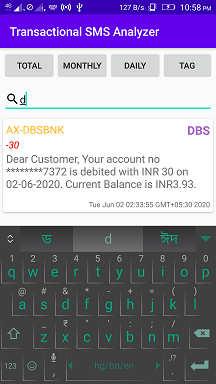

- Click on TOTAL Button, to see total expenses and total income

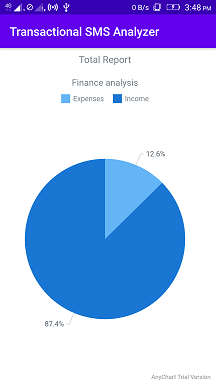
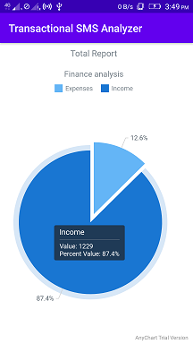
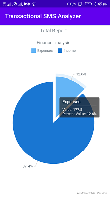

- Click on MONTHLY & DAILY Button, to see chart

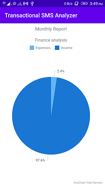
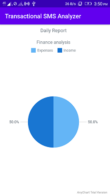

- Click on TAG Button, to see tag wise expenses chart
- Non tag sms will not be shown
- Tag sms that have no expenses, also will not be shown

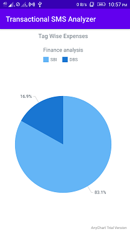
